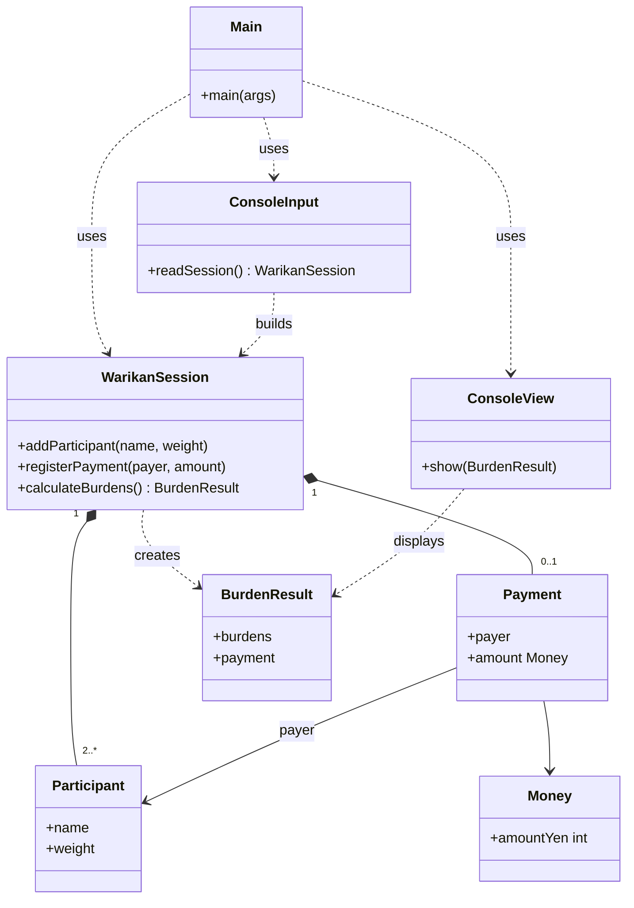

# クラス設計の方針

割り勘アプリのドメインモデルを、セッションを中心にクラスでまとめる
入力は Scanner で受け取る

# 今回やること

- 参加者・支払い・負担の割合（重み）を持つセッションを作る
- 一人当たりの負担額を自動計算する
- 負担額と、誰がいくら立て替えたかを表示する
- CUIの入力は Scanner で行う

# 今回やらないこと

- 支払いを複数件まとめる（旅行の精算など）
- 立て替えを複数人で分ける
- 誰が誰にいくら払うかの送金リスト
- パーセント指定や、負担額の直接指定
- ファイルやDBへの保存
- GUI

# 決めたルール

- 1回の割り勘 = 支払い1件
- 立て替える人は1人だけ
- 負担の割合は重み（整数の比）で表す。何も指定しなければ全員1で均等割り
- 金額は整数円。割り切れない分は切り捨てて、余った円は最初に登録した人に足す
- 結果は「各自の負担額」が分かればよい。立て替え情報は別に出してよい

# 重みの例

合計4000円、重みが A=2, B=1, C=1 のとき

- A: 2000円
- B: 1000円
- C: 1000円

# クラスのイメージ

- Main: アプリの入口。入力→計算→表示をつなぐだけ
- WarikanSession: 参加者・支払い・重みをまとめて持つ。負担額の計算もここでやる
- Participant: 名前と重み
- Payment: 立て替えた人と金額
- Money: 円の金額
- BurdenResult: 各自の負担額と、立て替え情報
- ConsoleInput: Scanner で入力を受け取ってセッションを組み立てる
- ConsoleView: 負担額などを表示する

# 基本フロー

1. 参加者の登録
2. 各参加者の重みの設定（省略したら1）
3. 支払った人と金額の登録
4. 一人当たりの負担額の自動計算
5. 負担額と立て替え情報の表示

# 計算の例

## 均等割り

参加者 A, B, C（重みはみんな1） Aが3000円立て替え

- A: 1000円
- B: 1000円
- C: 1000円

## 端数が出るとき

参加者 A, B, C（登録順この順、重みはみんな1） Aが1000円立て替え

- まず各333円、余り1円
- 余りは最初のAに足す
- A: 334円 / B: 333円 / C: 333円

# 前提

- 言語は Java（Scanner を使う）
- 参加者の名前はかぶらない
- 金額と重みは正の整数だけ受け付ける
